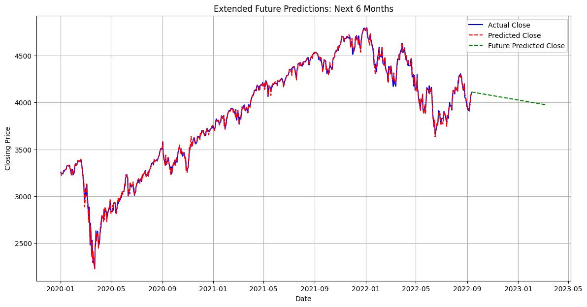

# SPY500 Stock Price Prediction



## Motivation
The motivation behind this project is to build an accurate and robust machine learning model to predict the S&P 500 Index. The ability to forecast stock prices can assist investors in making informed decisions, potentially leading to higher profits and reduced losses.

## Business Question
The primary business question addressed by this project is: "How can we use machine learning to predict the S&P 500 Index movements based on historical data, thereby helping investors make better investment decisions?"

## Objective
The objective of this project is to build a model capable of predicting the pattern of the S&P 500 Index using the available historical data. This project utilizes historical price data and advanced machine learning techniques to forecast future prices, focusing on daily closing prices.

## Methodology
Using a dataset comprising historical S&P 500 prices, the project involves several key phases:

1. **Data Preprocessing**: Cleansing and prepping data for the analysis, ensuring functionality for the predictive modeling.
2. **Exploratory Data Analysis (EDA)**: Conducting an intensive investigation to uncover hidden factors influencing the index.
3. **Feature Engineering**: Building an algorithm that generates and selects meaningful features from the data to improve model prediction.
4. **Model Development and Evaluation**: Using diverse statistical and machine learning tools to forecast stock price movements and assess their performance.

## Tools and Technologies
The project uses Python with additional libraries for data manipulation and analysis:
- **Pandas**: For data manipulation
- **Matplotlib**: For data visualization
- **Scikit-learn**: For implementing machine learning models

## Results
The results of the model are depicted below. The Linear Regression model closely follows the actual trend of the price movements, making the trend capture process more efficient.

### Key Metrics:
- **Mean Squared Error (MSE)**
- **Root Mean Squared Error (RMSE)**
- **Mean Absolute Error (MAE)**
- **R-squared (R²)**

### Analysis
- **Predicted vs. Actual Closing Prices**: The Linear Regression model reflects the actual trend appropriately over the tested period.
- **Extended Future Predictions**: The model forecasts the future trend for six months, highlighting the constraints of stock price forecasting and the inherent uncertainties.

## Limitations and Challenges
- **Limited Data and Timeframe**: The model uses a limited dataset within a specific timeframe, and it does not account for real-time data, which can render the model obsolete as market conditions change.
- **Model Obsolescence**: Machine learning models trained on historical data can become obsolete if not updated regularly with new data.

## Running the Project
To run the project, follow these steps:

1. Clone the repository:
    ```sh
    git clone https://github.com/boss2256/SPY500-StockPrediction.git
    cd SPY500-StockPrediction
    ```

2. Install the required dependencies:
    ```sh
    pip install -r requirements.txt
    ```

3. Run the web application:
    ```sh
    cd Cats-vs-Dogs-App
    flask run
    ```

## Conclusion
The Linear Regression model has proved to be a reliable tool that reflects stock trends appropriately over the tested period. Future work includes hyperparameter tuning and incorporating more complex datasets covering macroeconomic factors and sentiment analysis for a comprehensive view of stock price movements.

## References
- Rodriguez, F. S., Norouzzadeh, P., Anwar, Z., Snir, E., & Rahmani, B. (2024). A machine learning approach to predict the S&P 500 absolute percent change. Discover Artificial Intelligence, 4(1). [DOI](https://doi.org/10.1007/s44163-024-00104-9)
- Fuster, A., & Zou, Z. (n.d.). Using Machine Learning Models to Predict S&P500 Price Level and Spread Direction. [Report](https://cs229.stanford.edu/proj2020spr/report/Fuster_Zou.pdf)
- Hayes, A. (2022, June 12). Understanding Time Series. Investopedia. [Link](https://www.investopedia.com/terms/t/timeseries.asp)
- LinkedIn (n.d.). What methods can you use to validate time series data accuracy? [Link](https://www.linkedin.com/advice/3/what-methods-can-you-use-validate-time-series-rwxme#:~:text=Time%20series%20cross-validation%20involves)
